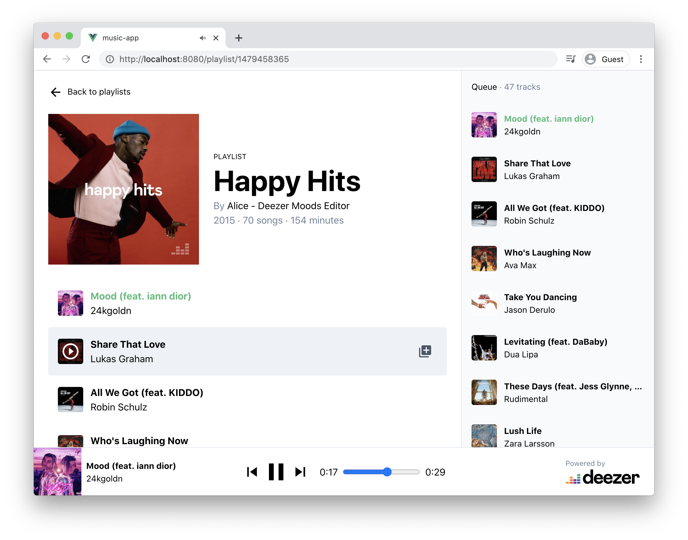

# About

This is an exercice made during the TWEB course at HEIG-VD in 2020. The goal was to learn Vue.js and and to work with an external API, in this case Deezer's API.

> In this exercise, you'll practice with Vue.js, Vue Router, and Vuex by building a music player web application. The application will fetch Data from [Deezer Simple API](https://developers.deezer.com/api) and use the [HTML audio element](https://developer.mozilla.org/en-US/docs/Web/HTML/Element/audio) to play tracks in the browser. Here is an illustration of how your app could look like:




## Project setup

This project was initialize with [Vue CLI](https://cli.vuejs.org/) and it's also using the [vue-cli-plugin-express](https://github.com/mathieutu/vue-cli-plugin-express). 


First, run the following command to install project dependencies

```sh
yarn install
```

Then start the server with
```sh
yarn express
```

And finally starts the Vue.js application with
```sh
yarn serve
```

